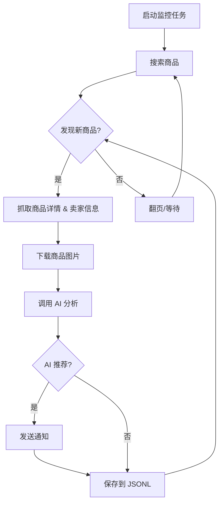

# 闲鱼智能监控机器人

基于 Playwright 和 AI 的闲鱼多任务实时监控工具，提供完整的 Web 管理界面。

> **🎉 v2.0 重构版本**: 采用全新的分层架构设计，前端升级为 Vue 3 + TypeScript，后端重构为 DDD 分层架构，提供更好的可维护性和扩展性。

## ✨ 核心特性

- **🎨 现代化 Web UI**: Vue 3 + TypeScript + shadcn-vue，响应式设计，流畅体验
- **🏗️ 分层架构**: DDD 领域驱动设计，API → 服务 → 领域 → 基础设施
- **🤖 AI 驱动**: 自然语言创建任务，多模态模型深度分析商品
- **⚡ 多任务并发**: 独立配置关键词、价格、筛选条件和 AI Prompt
- **📬 即时通知**: 支持 ntfy.sh、企业微信、Bark、Telegram、Webhook
- **⏰ 定时调度**: Cron 表达式配置周期性任务
- **🐳 Docker 部署**: 一键容器化部署，多阶段构建优化

## 📸 截图


## 🚀 快速开始

### 环境准备

**要求**: Python 3.10+

```bash
git clone https://github.com/Usagi-org/ai-goofish-monitor
cd ai-goofish-monitor
pip install -r requirements.txt
playwright install chromium
```

### 配置

1. **创建配置文件**

```bash
cp .env.example .env
```

2. **核心配置项**

| 变量 | 说明 | 必填 |
|------|------|------|
| `OPENAI_API_KEY` | AI 模型 API Key | 是 |
| `OPENAI_BASE_URL` | API 接口地址（兼容 OpenAI 格式） | 是 |
| `OPENAI_MODEL_NAME` | 多模态模型名称（如 `gemini-2.5-pro`） | 是 |
| `WEB_USERNAME` / `WEB_PASSWORD` | Web 界面登录凭据（默认 `admin` / `admin123`） | 否 |
| `NTFY_TOPIC_URL` | ntfy.sh 通知地址 | 否 |

完整配置项参考 `.env.example`

3. **获取登录状态**

启动服务后，访问 Web UI → **系统设置** → **手动更新登录状态**，按提示使用 [Chrome 扩展](https://chromewebstore.google.com/detail/xianyu-login-state-extrac/eidlpfjiodpigmfcahkmlenhppfklcoa) 提取登录信息。

### 构建前端

⚠️ **首次运行前必须构建前端**：

```bash
cd web-ui
npm install
npm run build
cd ..
```

> 💡 前端构建产物会生成到 `dist/` 目录，后端会自动服务这些静态文件。

### 启动服务

```bash
# 方式 1: 直接运行
python -m src.app

# 方式 2: 使用 uvicorn（推荐）
uvicorn src.app:app --host 0.0.0.0 --port 8000 --reload
```

访问 `http://127.0.0.1:8000`，使用自然语言创建监控任务即可开始使用。

## 🐳 Docker 部署（推荐）

### 第 1 步: 环境准备

1. **安装 Docker**: 确保系统已安装 [Docker Engine](https://docs.docker.com/engine/install/)

2. **克隆项目**:
```bash
git clone https://github.com/Usagi-org/ai-goofish-monitor
cd ai-goofish-monitor
```

3. **配置环境变量**: 创建 `.env` 文件并填写配置（参考上方配置说明）

### 第 2 步: 启动容器

```bash
docker-compose up --build -d
```

> 💡 Docker 会自动构建前端（Vue 3）和后端（Python），无需手动构建。

### 第 3 步: 配置登录状态

⚠️ **重要**: Docker 容器内无法扫码登录，需要通过 Web UI 手动更新：

1. 访问 `http://127.0.0.1:8000`
2. 进入 **系统设置** → **手动更新登录状态**
3. 使用 [Chrome 扩展](https://chromewebstore.google.com/detail/xianyu-login-state-extrac/eidlpfjiodpigmfcahkmlenhppfklcoa) 提取登录信息并粘贴

### 容器管理

```bash
# 查看日志
docker-compose logs -f

# 停止容器
docker-compose stop

# 启动已停止的容器
docker-compose start

# 停止并移除容器
docker-compose down
```

## 🏗️ 架构说明

### 后端架构（DDD 分层设计）

```
API 层 (src/api/routes)
    ↓
服务层 (src/services)
    ↓
领域层 (src/domain)
    ↓
基础设施层 (src/infrastructure)
```

**核心组件**:
- **TaskService**: 任务管理
- **ProcessService**: 进程管理（启动/停止爬虫）
- **SchedulerService**: 定时调度（APScheduler）
- **AIAnalysisService**: AI 分析服务
- **NotificationService**: 通知服务（插件化设计）

### 前端架构（Vue 3 + TypeScript）

- **技术栈**: Vue 3 + Vite + TypeScript + shadcn-vue + Tailwind CSS
- **设计模式**: Composables 管理状态，容器组件 vs 展示组件
- **构建产物**: `web-ui/dist/`

## 💻 Web UI 功能

<details>
<summary>点击展开功能详情</summary>

### 任务管理
- **AI 创建任务**: 自然语言描述需求，一键生成任务和 AI 分析标准
- **可视化编辑**: 表格中直接修改任务参数（关键词、价格、定时规则等）
- **独立控制**: 每个任务可独立启动、停止、删除
- **定时调度**: 配置 Cron 表达式实现自动化运行

### 结果查看
- **卡片式浏览**: 图文卡片清晰展示商品信息
- **智能筛选**: 一键筛选 AI 推荐商品
- **多维排序**: 按爬取时间、发布时间、价格排序
- **详情查看**: 完整抓取数据和 AI 分析 JSON 结果

### 运行日志
- **实时日志流**: 网页实时查看爬虫运行日志
- **日志管理**: 自动刷新、手动刷新、一键清空

### 系统设置
- **状态检查**: 检查配置、登录状态等关键依赖
- **Prompt 编辑**: 在线编辑 AI 分析的 Prompt 文件

</details>

## 🚀 工作流程



## 🔐 Web 界面认证

Web 界面已启用 Basic 认证保护。

**默认凭据**:
- 用户名: `admin`
- 密码: `admin123`

⚠️ **生产环境请务必修改默认密码！**

在 `.env` 文件中配置:
```bash
WEB_USERNAME=your_username
WEB_PASSWORD=your_password
```

## ❓ 常见问题

<details>
<summary>点击展开常见问题</summary>

详细的常见问题解答请查看 [FAQ.md](FAQ.md)

**快速问答**:
- **Q: Docker 容器无法登录闲鱼？**
  A: 容器内无法扫码，需通过 Web UI 手动更新登录状态

- **Q: 如何更换 AI 模型？**
  A: 修改 `.env` 中的 `OPENAI_MODEL_NAME`，支持所有兼容 OpenAI 格式的模型

- **Q: 前端构建失败？**
  A: 确保 Node.js 版本 >= 18，执行 `cd web-ui && npm install && npm run build`

</details>

## 🙏 致谢

<details>
<summary>点击展开致谢内容</summary>

本项目在开发过程中参考了以下优秀项目：
- [superboyyy/xianyu_spider](https://github.com/superboyyy/xianyu_spider)

感谢 LinuxDo 社区和 [@jooooody](https://linux.do/u/jooooody/summary) 的脚本贡献。

感谢 Claude Code / Gemini 等 AI 工具，让 Vibe Coding 成为可能。

</details>

## ⚠️ 注意事项

<details>
<summary>点击展开注意事项</summary>

- 请遵守闲鱼的用户协议和 robots.txt 规则
- 不要进行过于频繁的请求，避免对服务器造成负担
- 本项目仅供学习和技术研究使用，请勿用于非法用途
- 采用 [MIT 许可证](LICENSE) 发布，按"现状"提供，不提供任何担保
- 详细信息请查看 [免责声明](DISCLAIMER.md)

</details>

## ⭐ Star History

[](https://www.star-history.com/#Usagi-org/ai-goofish-monitor&Date)

---

## 📚 相关文档

- [CLAUDE.md](CLAUDE.md) - Claude Code 开发指南
- [FAQ.md](FAQ.md) - 常见问题解答
- [DISCLAIMER.md](DISCLAIMER.md) - 免责声明
- [FRONTEND_REFACTOR_ARCHITECTURE.md](FRONTEND_REFACTOR_ARCHITECTURE.md) - 前端架构设计

## 📄 许可证

[MIT License](LICENSE)
